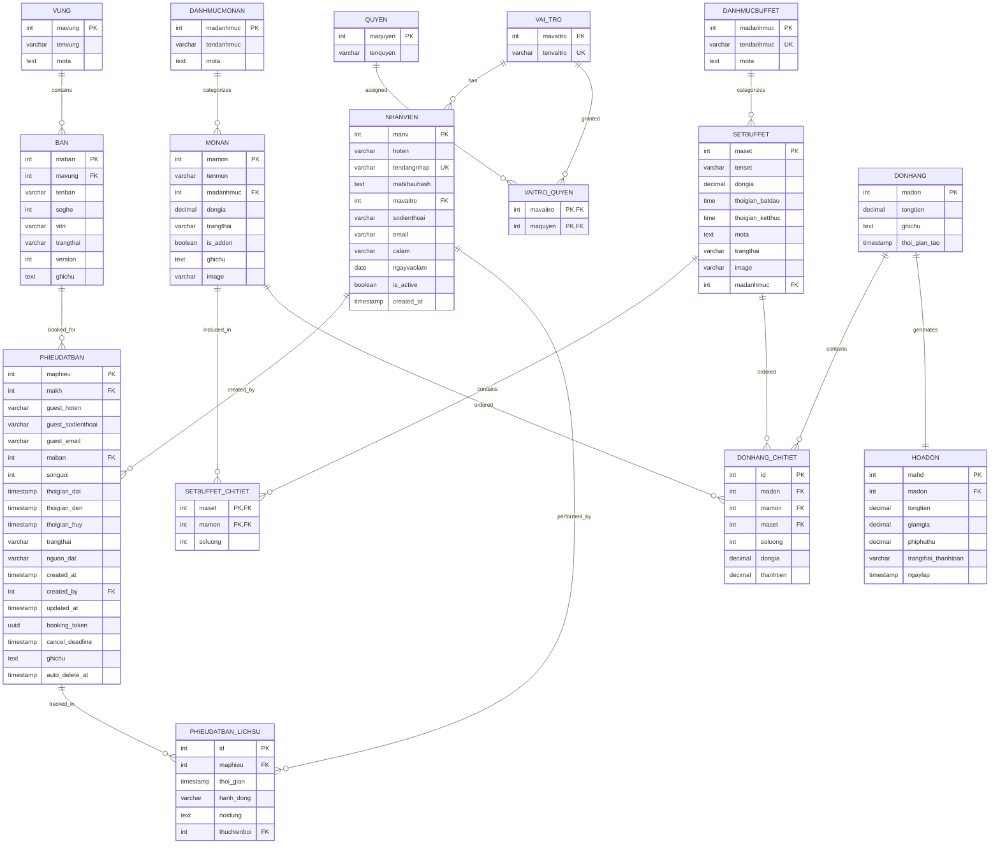

# 🗃️ DATABASE ERD DIAGRAM - BUFFET RESTAURANT SYSTEM

## 📊 Entity Relationship Diagram



## 📋 TABLE DESCRIPTIONS

### 🏢 **Core Management Tables**

#### 1. **VUNG** (Areas/Zones)

- Quản lý các khu vực trong nhà hàng (VIP, thường, ngoài trời...)
- **Primary Key**: `mavung`

#### 2. **BAN** (Tables)

- Quản lý bàn ăn với trạng thái và vị trí
- **Foreign Key**: `mavung` → VUNG
- **States**: 'Trong', 'DaDat', 'DangSuDung', 'BaoTri'

#### 3. **NHANVIEN** (Employees)

- Quản lý thông tin nhân viên và đăng nhập
- **Foreign Key**: `mavaitro` → VAI_TRO
- **Unique**: `tendangnhap`

#### 4. **VAI_TRO** & **QUYEN** (Roles & Permissions)

- Hệ thống phân quyền RBAC (Role-Based Access Control)
- Many-to-many relationship qua `VAITRO_QUYEN`

### 🍽️ **Menu & Product Tables**

#### 5. **DANHMUCMONAN** (Food Categories)

- Phân loại món ăn: Khai vị, Món chính, Tráng miệng...

#### 6. **MONAN** (Food Items)

- Chi tiết từng món ăn với giá và trạng thái
- **Foreign Key**: `madanhmuc` → DANHMUCMONAN

#### 7. **SETBUFFET** & **SETBUFFET_CHITIET** (Buffet Sets)

- Set buffet với thời gian phục vụ
- Chi tiết các món trong set
- **Foreign Keys**: `madanhmuc` → DANHMUCBUFFET, `mamon` → MONAN

### 📋 **Booking Tables**

#### 8. **PHIEUDATBAN** (Booking Records)

- Phiếu đặt bàn với thông tin khách và trạng thái
- **Foreign Keys**: `maban` → BAN, `created_by` → NHANVIEN
- **Unique**: `booking_token` (UUID)

#### 9. **PHIEUDATBAN_LICHSU** (Booking History)

- Audit trail cho các thay đổi đặt bàn
- **Foreign Keys**: `maphieu` → PHIEUDATBAN, `thuchienboi` → NHANVIEN

### 💰 **Order & Payment Tables**

#### 10. **DONHANG** & **DONHANG_CHITIET** (Orders)

- Đơn hàng và chi tiết món đã order
- Support cả món lẻ và set buffet

#### 11. **HOADON** (Invoices)

- Hóa đơn thanh toán với thuế và phí
- **Foreign Key**: `madon` → DONHANG

## 🔗 KEY RELATIONSHIPS

### Primary Relationships:

1. **VUNG** → **BAN** (1:N) - Một vùng chứa nhiều bàn
2. **BAN** → **PHIEUDATBAN** (1:N) - Một bàn có nhiều lần đặt
3. **MONAN** → **SETBUFFET_CHITIET** (1:N) - Món ăn thuộc nhiều set
4. **DONHANG** → **HOADON** (1:1) - Mỗi đơn hàng có một hóa đơn

### Secondary Relationships:

- **VAI_TRO** ↔ **QUYEN** (N:N) - Phân quyền RBAC
- **PHIEUDATBAN** → **PHIEUDATBAN_LICHSU** (1:N) - Audit trail
- **DONHANG_CHITIET** references both **MONAN** và **SETBUFFET**

## 📊 BUSINESS FLOW MAPPING

```
Customer Journey:
VUNG → BAN → PHIEUDATBAN → DONHANG → HOADON

Menu Management:
DANHMUCMONAN → MONAN → SETBUFFET_CHITIET ← SETBUFFET ← DANHMUCBUFFET

Staff Management:
VAI_TRO → VAITRO_QUYEN ← QUYEN
     ↓
  NHANVIEN
```

## 🎯 KEY FEATURES

✅ **Optimistic Locking**: `version` field in BAN table  
✅ **Audit Trail**: PHIEUDATBAN_LICHSU for booking changes  
✅ **UUID Tokens**: Secure booking references  
✅ **RBAC System**: Role-based permissions  
✅ **Flexible Menu**: Both individual items and buffet sets  
✅ **Guest Support**: Non-member booking capability  
✅ **Status Tracking**: Complete state management

---

_📊 This ERD represents a comprehensive restaurant management system with booking, menu, staff, and payment capabilities._
